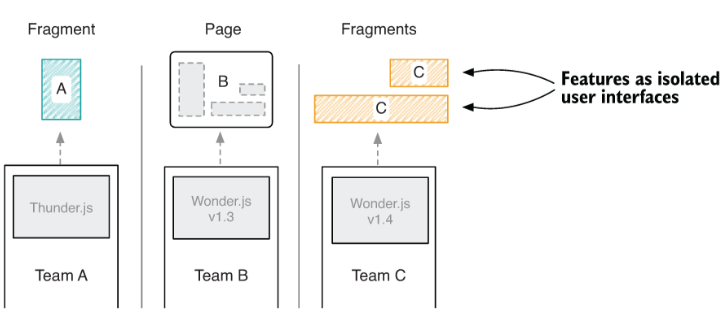
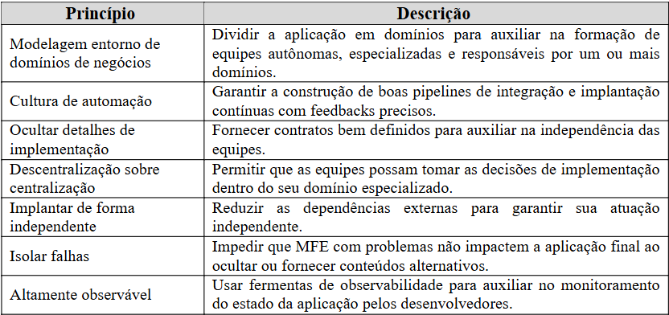
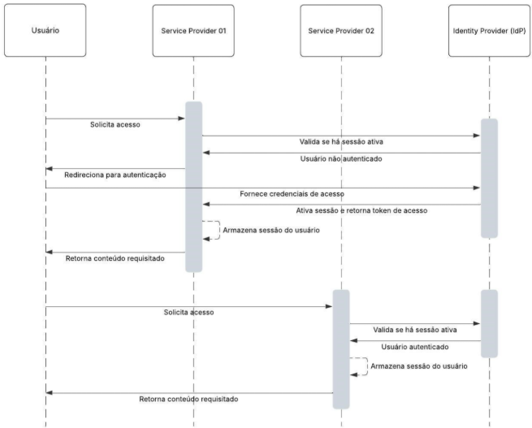
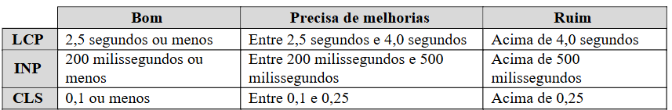

# 2 REFERÊNCIAL TEÓRICO

Neste capítulo, são apresentados os conceitos fundamentais, tecnologias e abordagens utilizadas no desenvolvimento da
aplicação proposta. Serão explorados os princípios da arquitetura de MFE, o funcionamento da abordagem Module Federation
dentro do ecossistema Vite, conceitos de autenticação por SSO, cookies HTTP e Core Web Vitals. Além disso, serão
discutidos trabalhos relacionados que contribuem para a fundamentação teórica deste estudo.

**2.1 Fundamentação Teórica**

**_2.1.1 Arquitetura de Microfrontends_**

A arquitetura de Microsserviços (MS) emergiu como uma estratégia para lidar com a alta complexidade e os desafios de
manutenção de sistemas monolíticos. Inicialmente aplicada em projetos de back-end, projetos que seguem o padrão de MS
são compostos por pequenos serviços independentes e intercomunicáveis, modelados em torno de um domínio de negócio,
seguindo princípios do Domain-Driven Design (DDD) (KHONONOV, 2021) que auxilia a construção de softwares alinhados a um
domínio de negócio. Com essa arquitetura torna-se mais evidente onde cada funcionalidade deve ser implementada,
permitindo que equipes de back-end sejam organizadas de forma autônoma, cada uma responsável por um ou mais serviços
específicos, o que reduz a complexidade individual de cada módulo (NEWMAN, 2015).

Dada a semelhança entre os desafios enfrentados por grandes projetos monolitos (POWELL e SMALLEY, 2024) no back-end e no
front-end, conceitos consolidados dos MS foram adaptados para o front-end, dando origem ao padrão arquitetural conhecido
como Microfrontends. Esse padrão arquitetural divide a aplicação front-end em fatias verticais. As fatias são interfaces
de usuário (User Interface – UI) construídas a partir de dados retornados por serviços, bancos de dados ou MS. Cada
fatia é de responsabilidade de uma equipe e são integradas no navegador web do cliente a fim de formar a página final (
GEERS, 2020).

A adoção de MFE pode auxiliar na redução do tempo de desenvolvimento, pois, com a divisão do projeto em domínios, as
equipes ganham maior autonomia para a definição de prioridades e poder de escolha sobre como será a implementação. Além
disso, cada equipe pode definir o prazo de entrega do artefato ao usuário sem impactar as demais, tornando esse processo
mais descentralizado (GEERS, 2020).

Por trás de cada fatia há um time responsável pela entrega de um fragmento ou página que irá compor a aplicação final (
Figura 01). Essas interfaces de usuário são desenvolvidas e funcionam de forma isolada, dessa forma, caso alguma delas
estiver fora do ar, nada impedirá que as outras funcionem aplicadas em outros contextos. Cada equipe responsável por um
MFE tem o poder de decidir a tecnologia e qual versão desta tecnologia melhor atenderá a suas demandas e, por se tratar
de aplicações que não compartilham código, frameworks e bibliotecas JavaScript, é possível garantir que o funcionamento
em conjunto não será impactado (GEERS, 2020).

Figura 1 – Divisão de aplicações MFE entre times front-end, que podem ser responsáveis por páginas ou fragmentos.

Fonte: Geers (2020).

Na divisão por páginas, uma página inteira é de responsabilidade de uma equipe dentro do time de front-end. A equipe
deve manter esta página em funcionamento e desenvolver ou acrescentar as funcionalidades e componentes que a constituem.
Cada página é fracamente acoplada e podem ser acessíveis apenas por meio de um domínio público (GEERS, 2020).

Quando há um componente que aparece repetidamente dentro de várias páginas de uma aplicação MFE, não é ideal que ele
seja refeito onde for necessário novamente. Nesses casos, a solução seria a criação de apenas um componente para evitar
a replicação de código. Esse componente pode ser entendido como um fragmento. Os fragmentos são mini aplicativos
incorporáveis e isolados do resto da página, onde equipes (responsáveis por outras páginas) podem utilizar um fragmento
desenvolvido por outra time sem a necessidade de conhecer seus detalhes de implementação (GEERS, 2020).

Assim como qualquer padrão arquitetural, a abordagem de MFE apresenta desafios de implementação. Definir o modo de
visualização — se haverá múltiplos MFE carregados simultaneamente ou apenas um por vez —, a composição, o roteamento e a
estrutura de comunicação são decisões arquitetônicas que devem ser tomadas antecipadamente, pois impactam diretamente o
futuro do sistema (MEZZALIRA, 2021).

**<u>2.1.1.1 Roteamento e Transições de Páginas</u>**

A integração por roteamento e transição de páginas se concentra na navegação do usuário entre páginas desenvolvidas por
diferentes equipes. Nesse tipo de incorporação de MFE, é possível utilizar Hiperlinks ou Application Shell como técnicas
de integração.

Os Hiperlinks representam a forma mais simples de integrar páginas MFE, pois uma equipe precisa apenas inserir um link
para acessar o conteúdo desenvolvido por outra (GEERS, 2020). No entanto, essa abordagem geralmente exige chamadas a um
servidor para recuperar as páginas, caracterizando-se como uma integração server-side.

O Application Shell pode ser definido como um componente base contendo o mínimo necessário de HTML, CSS e JavaScript
para fornecer a interface de usuário de uma aplicação. Essa técnica é frequentemente utilizada em Progressive Web Apps (
PWA), onde o template base é armazenado em cache offline, melhorando o desempenho do carregamento do aplicativo (OSMANI,
2020). No contexto de MFE, o Application Shell permite a transição entre páginas no lado do cliente (client-side),
atuando como uma aplicação central que determina qual página deve ser exibida com base na URL atual. Isso implica que,
ao alterar a URL, a página correspondente também é modificada (GEERS, 2020).

**<u>2.1.1.2 Composição</u>**

A composição é utilizada quando se deseja incorporar fragmentos em páginas. Para isso, existem três abordagens
principais: integração server-side, integração client-side e integração híbrida.

Na integração server-side, a composição dos fragmentos ocorre antes que a página seja exibida no navegador do cliente.
Um servidor compositor é responsável por montar a página final, atuando como intermediário entre o navegador e os
servidores que fornecem as páginas e fragmentos desenvolvidos pelas equipes de front-end. Como alternativa ao uso de um
servidor compositor, a equipe responsável por uma página pode buscar diretamente os fragmentos fornecidos por outras
equipes (GEERS, 2020).

Já na integração client-side, cada fragmento funciona como um pequeno aplicativo independente, e a composição ocorre
diretamente no navegador, utilizando a API Document Object Model (DOM). Essa abordagem permite que os fragmentos sejam
renderizados e atualizados sem impactar o restante da página. Além disso, quando necessário, os fragmentos podem se
comunicar com outros MFE por meio da transmissão de eventos. Dentro desse contexto, os Web Components surgem como um
modelo padronizado que permite encapsular fragmentos independentes, desenvolvidos em diferentes tecnologias, garantindo
sua coexistência em uma mesma página (GEERS, 2020).

Por fim, a integração híbrida combina diferentes estratégias para compor fragmentos em páginas, sendo os iframes e
chamadas Ajax duas das técnicas mais comuns. Os iframes proporcionam isolamento entre os fragmentos, garantindo um fraco
acoplamento, de modo que qualquer alteração no conteúdo dentro do iframe não afete o restante da página. Já o Ajax
permite uma integração mais dinâmica, onde chamadas JavaScript são feitas ao servidor para carregar fragmentos na página
de forma assíncrona.

**<u>2.1.1.3 Comunicação</u>**

A comunicação em MFE diz respeito à necessidade de integração de informações entre diferentes fragmentos da aplicação.
Para que os MFE possam interagir entre si, existem dois cenários principais de comunicação: interface de usuário e
contexto global.

A comunicação por interface de usuário ocorre diretamente no navegador do usuário e envolve a propagação de dados entre
diferentes elementos da aplicação, como página-fragmento, fragmento-página e fragmento-fragmento. Esse tipo de
comunicação permite que os MFE atualizem seus estados e atributos conforme necessário. Nessa abordagem, cada equipe
desenvolve seu MFE de forma a emitir mudanças de estado ou atributos, permitindo que outros MFE dependentes sejam
atualizados adequadamente (GEERS, 2020).

Já a comunicação por contexto global surge da necessidade de manter todos os MFE sincronizados com informações
compartilhadas. Para que isso seja possível, elas são armazenadas em um local centralizado, onde podem ser acessadas por
diferentes fragmentos da aplicação. No entanto, esse contexto é geralmente restrito apenas à leitura (GEERS, 2020).

**<u>2.1.1.4 Princípios da Arquitetura de Microfrontends</u>**

A adoção da arquitetura de MFE demanda a consideração de princípios fundamentais (Quadro 1), que são, em grande parte,
semelhantes aos aplicados em arquiteturas de MS.

Quadro 1 – Princípios da arquitetura de MFE.

Fonte: adaptado de Mezzalira (2025).

É importante enfatizar que MFE aplicam-se para cenários específicos e devem ser adotados apenas quando seus pontos
positivos superarem os negativos. Afinal, nenhuma solução deve ser considerada uma “bala de prata” para os desafios do
sistema (BROOKS, 1995). Dessa forma, a tecnologia deve se adaptar ao problema, e não o contrário.

**_2.1.2 Module Federation_**

A arquitetura de MFE depende de técnicas de roteamento e composição para que cada domínio seja integrado à aplicação
final. A introdução do Module Federation no Webpack 5 se tornou mais uma estratégia de composição. O Module Federation
segue o princípio de unir compilações de diferentes aplicações em único aplicativo. Uma das principais vantagens dessa
abordagem é possibilitar o compartilhamento de código e dependências entre diferentes compilações de aplicações, o que
permite impulsionar a modularização e escalonamento (WEBPACK, 2020).

**<u>2.1.2.1 Module Federation no Ecossistema Vite</u>**

Baseando-se nos conceitos de Module Federation do Webpack 5, o plugin vite-plugin-federation (VITEFEDERATION, 2025)
viabilizou a construção de MFE no ambiente de desenvolvimento do Vite. Entretanto, apesar das semelhanças conceituais, o
Module Federation no Vite apresenta peculiaridades. Entre elas, destaca-se a definição de que sistemas que adotam essa
abordagem são compostos de, no mínimo, dois projetos: aplicação hospedeira e aplicação remota (VITEFEDERATION, 2025).

Na configuração do módulo remoto, é possível expor seus recursos funcionais e elementos de interface. Já na configuração
do módulo hospedeiro, são definidas quais aplicações remotas que fazem parte do ecossistema e que irão compor o
aplicativo final. Além disso, é possível especificar quais dependências serão compartilhadas, permitindo que sejam
resolvidas em tempo de compilação (VITEFEDERATION, 2025).

**_2.1.3 Single Sign-On_**

O Single Sign-On é um método de autenticação única que permite ao usuário acesso a várias aplicações utilizando uma
única credencial. Esse processo ocorre por meio do compartilhamento da mesma sessão (SCAPICCHIO; FORREST, 2024).

O funcionamento do SSO baseia-se em uma relação de confiança mútua entre um ou mais Service Providers (SPs) e um
Identity Provider (IdP). Quando um usuário fornece credenciais válidas, o IdP gera um token de acesso contendo
informações sobre sua identidade. Assim, sempre que o usuário tentar acessar um SP dentro desse ecossistema de
confiança, o SP confirma a autenticidade do token junto ao SSO. Caso o token seja considerado válido, é gerado um
certificado digital que concede ao usuário acesso à aplicação (SCAPICCHIO; FORREST, 2024).

O fluxo fundamental de autenticação baseada em SSO consiste em cada SP dentro do sistema, ao receber uma requisição de
acesso, verifica se há uma sessão ativa do solicitante. Caso não haja sessão válida, o fluxo de autenticação é iniciado.
Após uma validação ou autenticação bem-sucedida, caso ainda não tenha feito, o SP armazena a sessão do usuário. Dessa
forma, em qualquer tentativa futura de acesso, o solicitante poderá ter acesso direto ao conteúdo sem a necessidade de
uma nova autenticação (Diagrama 1).

Diagrama 1 – Fluxo básico de funcionamento de um sistema SSO.

Fonte: elaborado pelos autores com dados extraídos de Scapicchio; Forrest (2024).

**_2.1.4 Cookies HTTP_**

Cookies HTTP são pequenos arquivos de texto enviados por um servidor web para o navegador do usuário com o objetivo de
armazenar informações que podem ser reutilizadas em requisições subsequentes. Sua principal função é possibilitar que o
servidor mantenha o estado da comunicação com o usuário, uma vez que o protocolo HTTP (Hypertext Transfer Protocol) é
por natureza sem estado (HTTP, 2025). Esses dados, denominados cookies, são geralmente utilizados para gerenciar sessões
de usuário, personalizar a experiência do usuário no site e viabilizar funcionalidades como a manutenção do login e
preferências de idioma (HTTPCOOKIES, 2025).

**_2.1.4 Core Web Vitals_**

O Core Web Vitals é um conjunto de métricas definidas pela Google como fundamentais para avaliar a experiência do
usuário em páginas web. Essas métricas possibilitam que proprietários e desenvolvedores de sites aprimorem o desempenho
de suas páginas ao focar nos aspectos mais relevantes de forma simplificada. Cada métrica representa uma dimensão
específica da experiência do usuário, sendo elas: carregamento (Largest Contentful Paint — LCP), interatividade (
Interaction to Next Paint — INP) e estabilidade visual (Cumulative Layout Shift — CLS) (WALTON, 2020).

Para que um site seja considerado performático, ele deve atender a critérios elaborados pela Google (Quadro 2). Esses
critérios são: (i) o LCP deve ocorrer em menos de 2,5 segundos; (ii) o INP deve estar disponível em menos de 200
milissegundos; e (iii) o CLS deve manter uma pontuação igual ou inferior a 0,1. Para ser aprovada, a página precisa
atingir pelo menos 75% de conformidade em cada uma dessas métricas do Core Web Vitals (WALTON, 2020).

Quadro 2 – Categorização do Core Web Vitals.

Fonte: adaptado de Walton (2020).

A análise dessas métricas é realizada, prioritariamente, em ambiente real (campo), com dados coletados a partir das
interações dos usuários em diferentes dispositivos, redes e condições de uso. No entanto, muitas delas também podem ser
medidas em laboratório, onde os testes são conduzidos de forma controlada e visam auxiliar os desenvolvedores a
identificar e resolver antecipadamente eventuais problemas de desempenho (WALTON, 2020).

As ferramentas recomendadas para mensurar as métricas do Core Web Vitals incluem PageSpeed Insights, Lighthouse, Chrome
DevTools, Search Console e a extensão Web Vitals (CHROME, 2025).

**2.2 Trabalhos Relacionados**

**_2.2.1 Microfrontend: Um Estudo Sobre O Conceito E Aplicação No Frontend_**

O estudo realizado por Nascimento e Sotto (2020) teve como objetivo demonstrar o conceito e a aplicação da arquitetura
de MFE, com foco na divisão do front-end em partes menores e independentes. Além disso, busca evidenciar os benefícios e
desafios da adoção dessa abordagem, bem como discutir os impactos resultantes da evolução dos sistemas de informação.

Para a realização do estudo, os autores conduziram uma pesquisa bibliográfica e desenvolveram uma aplicação com
abordagem de MFE utilizando a biblioteca React.js e os frameworks Angular.js e Vue.js. O sistema implementado permite
buscar e listar repositórios e usuários por meio de uma API (Application Programming Interface) disponibilizada pelo
GitHub.

Os resultados indicaram que a arquitetura de MFE pode reduzir a complexidade associada a aplicações monolíticas,
diminuir o acoplamento e melhorar a escalabilidade e a organização do código. Além disso, os autores destacam que a
abordagem proporciona maior flexibilidade no desenvolvimento de soluções empresariais. No entanto, ressaltam que a
adoção de MFE deve ser feita de forma criteriosa, uma vez que seu uso inadequado em aplicações de pequeno porte pode
gerar mais problemas do que benefícios.

Por fim, concluíram que uso da arquitetura de MFE permite avanços no desenvolvimento de software para a web, oferecendo
flexibilidade e escalabilidade em sistemas distribuídos. No entanto, requer atenção à maturidade e à escolha adequada
para evitar complexidade desnecessária e garantir a uniformidade entre os sistemas. Quando bem implementada, a
arquitetura de MFE apresenta-se como uma solução vantajosa. O artigo destaca como a aplicação prática demonstrou seu
funcionamento e benefícios.

**_2.2.2 Motivations, benefits, and issues for adopting Micro-Frontends: A Multivocal Literature Review_**

Taibi, Mezzalira e Peltonen (2021) conduziram um estudo motivado pela hesitação das empresas em adotar a arquitetura de
MFE. O objetivo foi mapear e sintetizar, por meio de uma revisão literária multivocal (Multivocal Literature Review –
MLR), o conhecimento disponível sobre MFE, evidenciando as motivações para sua adoção, os benefícios alcançados e os
desafios enfrentados. Para isso, os autores elaboraram três questões de pesquisa: “Por que os profissionais estão
adotando Microfrontends?”, “Quais são os benefícios obtidos com o uso de Microfrontends?” e “Os Microfrontends
apresentam algum problema?”. A análise foi baseada em 173 fontes literárias, das quais apenas 43 foram consideradas
relevantes para o estudo.

Os resultados indicaram que a principal motivação para a adoção de MFE é a busca por maior independência das equipes e a
redução da complexidade de grandes aplicações front-end monolíticas. No que se refere aos benefícios, os autores
destacaram a criação de equipes multifuncionais autônomas e a facilidade em escalar processos. Por outro lado, os
desafios associados à adoção de MFE incluem o aumento do tamanho do payload (em português, carga útil) dos aplicativos,
a duplicação de código, o acoplamento entre equipes e a complexidade no monitoramento das aplicações.

Os autores concluíram que o estudo atingiu seu objetivo ao destacar implicações relevantes da adoção de MFE para
profissionais e pesquisadores da área. No entanto, ressaltaram a necessidade de investigações futuras mais amplas e
detalhadas sobre os tópicos abordados.

**_2.2.3 Micro Frontend Application Shell and Module Federation Architecture implementation and comparison_**

O estudo elaborado por Bahiense-Junior et al. (2024) seguiu a abordagem Design Science Research (DSR) aplicada à
Engenharia de Software. Para isso, os autores desenvolveram um modelo visual que captura as contribuições da pesquisa em
três aspectos: teoria, prática e avaliação. Além disso, o estudo comparou as abordagens Application Shell e Module
Federation, analisando tanto aspectos funcionais quanto não funcionais.

Os resultados obtidos evidenciaram que o Application Shell requer maior atenção em relação a segurança, roteamento e
gerenciamento de estado. Apesar de facilitar a centralização de dependências, o Application Shell exige um controle de
versão mais rigoroso. Além disso, ele é capaz de garantir a disponibilidade e atualização assíncrona de seus pacotes via
CDN (Content Delivery Network). No entanto, pode enfrentar desafios de sincronização de estados caso os MFE sejam
construídos em tecnologias diferentes, tornando necessária a adoção de eventos customizados.

Eles também apontaram que o Module Federation permite o carregamento dinâmico dos módulos remotos, porém, demanda
avançado conhecimento em Webpack e um bom controle das versões compartilhadas. Cada projeto possui sua própria esteira
de publicação (deployment pipeline), facilitando a escalabilidade e modularização. Embora promova um compartilhamento
descomplicado de módulos e dependências, isso requer uma maior atenção em relação a integridade dos dados. Para
estabelecer a comunicação em tempo real entres os MFE, recomenda-se o uso de eventos customizados ou do padrão
publish/subscribe.

Os autores concluíram que a análise comparativa destacou que o Application Shell e o Module Federation são adequados
para cenários distintos. Enquanto o Application Shell apresenta vantagens em projetos com múltiplas tecnologias e
equipes distribuídas, o Module Federation é mais indicado para aplicações que exigem rápida escalabilidade e integração.
Por fim, ressaltaram que a escolha entre as abordagens deve considerar as necessidades específicas do projeto e que, em
estudos futuros, pretendem investigar a possibilidade de combinar ambas as soluções. 