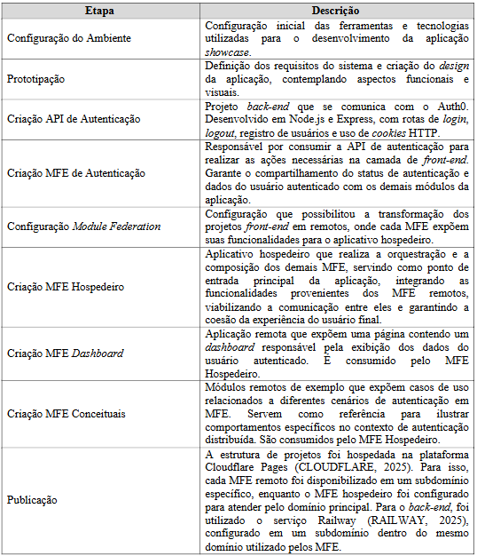

# 3 METODOLOGIA

Este estudo trata-se de uma pesquisa aplicada, com abordagem qualitativa e exploratória. O objetivo é levantar os
desafios e estratégias da autenticação Single Sign-On em arquiteturas Microfrontends utilizando Vite e Module
Federation. A pesquisa é baseada na revisão de literatura, experimentação prática e avaliação da aplicação.

Inicialmente, foi realizada uma pesquisa bibliográfica a fim de contextualizar Microfrontends, Module Federation, Single
Sign-On, cookies HTTP e Core Web Vitals para embasamento. Em seguida, ocorreu o desenvolvimento de uma aplicação
showcase a fim de oferecer um cenário realista para a experimentação e validação dos conceitos teóricos, funcionando
como uma prova de conceito voltada para a compreensão dos benefícios, limitações e desempenho da arquitetura de MFE no
ecossistema Vite com autenticação SSO.

**3.1 Procedimentos de Implementação**

A aplicação showcase foi desenvolvida utilizando a arquitetura de Microfrontends, integrando o Vite como ferramenta de
build — processo de compilação de código — e o framework Vue.js 3 com suporte à linguagem TypeScript. Para viabilizar a
composição entre as diferentes partes da aplicação, foi empregada a abordagem de Module Federation por meio do plugin
vite-plugin-federation.

O projeto conta com um módulo responsável pela autenticação via SSO, que gera tokens de acesso seguindo o padrão de
cookies HTTP. Essa abordagem permite a manutenção do estado de autenticação entre as diferentes partes da aplicação,
facilitando o compartilhamento da sessão do usuário. Para simplificar a implementação e manter o foco na camada de
front-end, foi utilizada a solução Auth0 (AUTH0, 2025) como provedor de identidade para o SSO. Além disso, foram
desenvolvidos outros módulos que dependem da sessão autenticada para apresentar suas funcionalidades. A implementação
seguiu uma sequência de passos definidos previamente (Quadro 3).

Quadro 3 – Etapas da Implementação da Arquitetura de Microfrontends.

Fonte: elaborado pelos autores (2025).

**3.2 Avaliação**

Para validar a viabilidade da arquitetura proposta, foi realizada a análise dos aspectos de desempenho, complexidade de
implementação e segurança.

O desempenho foi avaliado considerando o tempo de carregamento das páginas e a eficiência na composição dinâmica dos
módulos. Utilizou-se a aba Performance e a aba Lighthouse do Chrome DevTools para coletar sistematicamente os valores
dos Core Web Vitals (LCP, INP e CLS) de cada MFE remoto, integrado ao MFE Hospedeiro. Esses valores foram comparados com
os parâmetros recomendados pela Google (Quadro 2), e discutidos quanto à sua aderência aos requisitos de experiência do
usuário.

A complexidade foi analisada considerando a configuração do Module Federation, o gerenciamento de dependências
compartilhadas e o impacto na modularização da aplicação. Essa avaliação permitiu identificar os desafios enfrentados e
as decisões de configuração necessárias para garantir o correto funcionamento da arquitetura.

A segurança foi verificada por meio de inspeções manuais das implementações, validando o uso adequado de atributos de
cookies HTTP e o correto compartilhamento de sessão entre os MFE. Embora não tenham sido realizados testes automatizados
de vulnerabilidades, foram avaliadas práticas de segurança que visam mitigar riscos de vazamento de dados ou uso
indevido de sessões.

**3.3 Limitações da Pesquisa**

O estudo limita-se à análise da adoção de autenticação via SSO em Microfrontends, considerando exclusivamente as
tecnologias mencionadas. Dessa forma, não aborda o processo de autenticação no lado do back-end, nem aspectos
aprofundados de segurança ou desafios de implementação para outros frameworks JavaScript e provedores de identidade. 