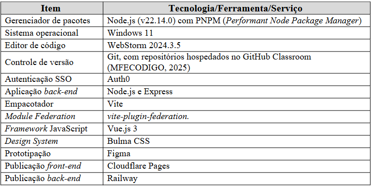
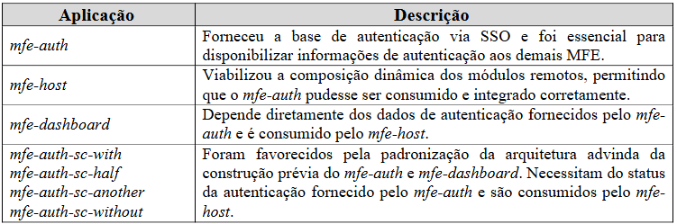
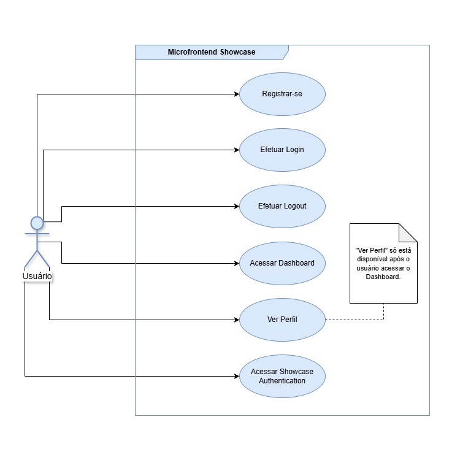
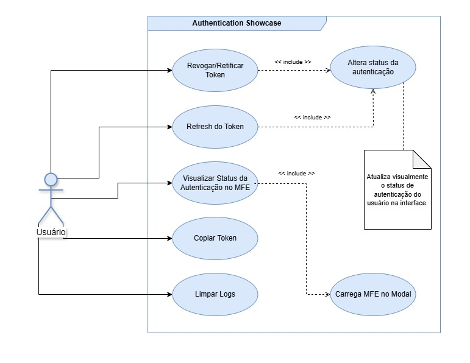
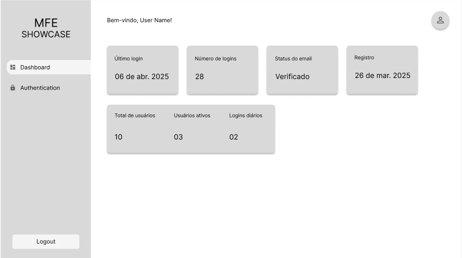
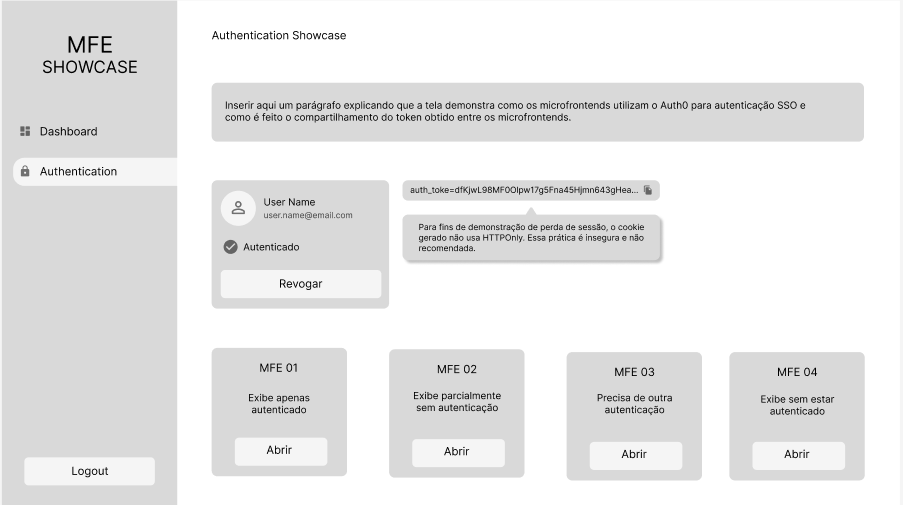
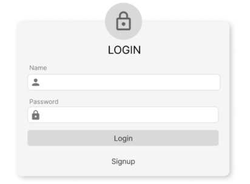
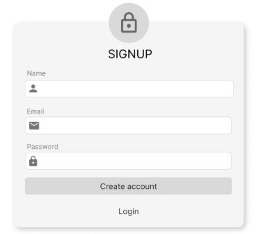

# 4 DESENVOLVIMENTO

Este capítulo descreve o processo de desenvolvimento da aplicação proposta, detalhando o ambiente utilizado, as etapas
seguidas para sua construção, os aspectos técnicos de sua arquitetura e modelagem, além de apresentar os principais
artefatos gerados ao longo do projeto. A estrutura foi pensada para viabilizar a experimentação, considerando os
desafios associados à integração da autenticação Single Sign-On em um cenário de Microfrontends utilizando Vue.js e
Vite.

**4.1 Ambiente de Desenvolvimento**

O ambiente de desenvolvimento foi configurado com foco em modularidade, agilidade e integração contínua entre os MFE.
Foi elaborada uma lista com os principais recursos utilizados (Quadro 4).

Quadro 4 – Tecnologias, Ferramentas e Serviços Utilizados.

Fonte: elaborado pelos autores (2025).

**4.2 Etapas do Desenvolvimento**

O processo de desenvolvimento foi conduzido de forma incremental e iterativa, permitindo validações frequentes e ajustes
quando necessário. As etapas definidas (Quadro 2) foram seguidas de modo não linear, devido à demanda constante por
alterações, correções e revisões que precisaram ser realizadas.

Com o ambiente e a prototipação prontos, a construção das aplicações seguiu uma ordem lógica de implementação (Quadro
5), que permitiu, inicialmente, o entendimento e a aplicação da abordagem de Module Federation. Primeiramente, foi
desenvolvido o MFE de autenticação (mfe-auth), responsável por fornecer a base de autenticação via SSO e servir como
provedor de dados de autenticação para os demais módulos. Na sequência, foi criado o MFE hospedeiro (mfe-host), que
possibilitou a integração dinâmica dos módulos por meio do consumo do mfe-auth, consolidando a prática de composição de
MFE. Com essas duas bases estabelecidas, foi desenvolvido o MFE de dashboard (mfe-dashboard), que consome dados do
mfe-auth e é integrado pelo mfe-host, demonstrando a orquestração entre módulos. A partir desse ponto, os demais MFE —
showcase dos casos de autenticação (mfe-auth-sc-with, mfe-auth-sc-half, mfe-auth-sc-another e mfe-auth-sc-without) —
foram implementados utilizando o mesmo modelo de autenticação e comunicação previamente definidos, seguindo uma
estrutura padronizada da arquitetura.

Quadro 5 – Sequência de Desenvolvimento das Aplicações

Fonte: elaborado pelos autores (2025).

**4.3 Modelo Lógico da Aplicação**

**_4.3.1 Diagrama de Casos de Uso_**

Diagrama 2 – Casos de Uso da aplicação Microfrontend Showcase

Fonte: elaborado pelos autores (2025).

Diagrama 3 – Casos de Uso do domínio Authentication Showcase.

Fonte: elaborado pelos autores (2025).

**_4.3.2 Requisitos do Sistema_**

Diagrama 4 – Requisitos Funcionais do Sistema.

| ID    | Descrição do Requisito                                                                                                                                  | Prioridade |
|-------|---------------------------------------------------------------------------------------------------------------------------------------------------------|------------|
| RF001 | O sistema deve permitir o cadastro de usuários com nome, e-mail e senha.                                                                                | ALTA       |
| RF002 | Emitir um relatório de tarefas no mês                                                                                                                   | ALTA       |
| RF003 | O sistema deve permitir o logout de usuários ao clicar no botão de sair.                                                                                | ALTA       |
| RF004 | O sistema deve ter um botão para exibir as informações de nome, e-mail e botão de logout.                                                               | ALTA       |
| RF005 | O sistema deve exibir um menu lateral com todos as opções de rotas mais o botão de logout.                                                              | ALTA       |
| RF006 | O sistema deve possuir um menu lateral com as opções Dashboard e Authentication.                                                                        | ALTA       |
| RF007 | O sistema deve exibir a página do dashboard com informações da autenticação e dos microfrontends.                                                       | ALTA       |
| RF008 | O sistema deve exibir a página com o showcase de Authentication.                                                                                        | ALTA       |
| RF009 | O sistema deve permitir testar o cenário de token revogado no showcase de Authentication.                                                               | ALTA       |
| RF010 | O sistema deve permitir ao usuário testar o cenário de retificar token no showcase de Authentication.                                                   | ALTA       |
| RF011 | O sistema deve permitir simular o comportamento de refresh do token no showcase de Authentication.                                                      | ALTA       |
| RF012 | O sistema deve permitir interagir com os microfrontends e observar o comportamento deles de acordo com o status do token no showcase de Authentication. | ALTA       |
| RF013 | O sistema deve permitir copiar o token no showcase de Authentication.                                                                                   | ALTA       |
| RF014 | O sistema deve exibir a descrição do showcase.                                                                                                          | ALTA       |

Fonte: elaborado pelos autores (2025).

Diagrama 5 – Requisitos Não Funcionais do Sistema.

| ID     | Categoria     | Descrição do Requisito                                                     |
|--------|---------------|----------------------------------------------------------------------------|
| RNF001 | Portabilidade | O sistema deve ser compatível com os navegadores Chrome, Firefox e Safari. |
| RNF002 | Portabilidade | O sistema deve estar otimizado apenas para telas com breakpoint de 1280px. |

Fonte: elaborado pelos autores (2025).

**_4.3.3 Apresentação da Interface_**

Para a construção da interface (MFEPROTOTIPO, 2025), foi utilizada a ferramenta de prototipação de designs Figma (FIGMA,
2025).

Figura 2 – Protótipo da interface do Dashboard.

Fonte: elaborado pelos autores (2025).

Figura 3 – Protótipo da interface da página Showcase Authentication.

Fonte: elaborado pelos autores (2025).

Figura 4 – Protótipo da interface da página de Login no formulário de autenticação

Fonte: elaborado pelos autores (2025).

Figura 5 – Protótipo da interface da página de Login no formulário de cadastro

Fonte: elaborado pelos autores (2025).

