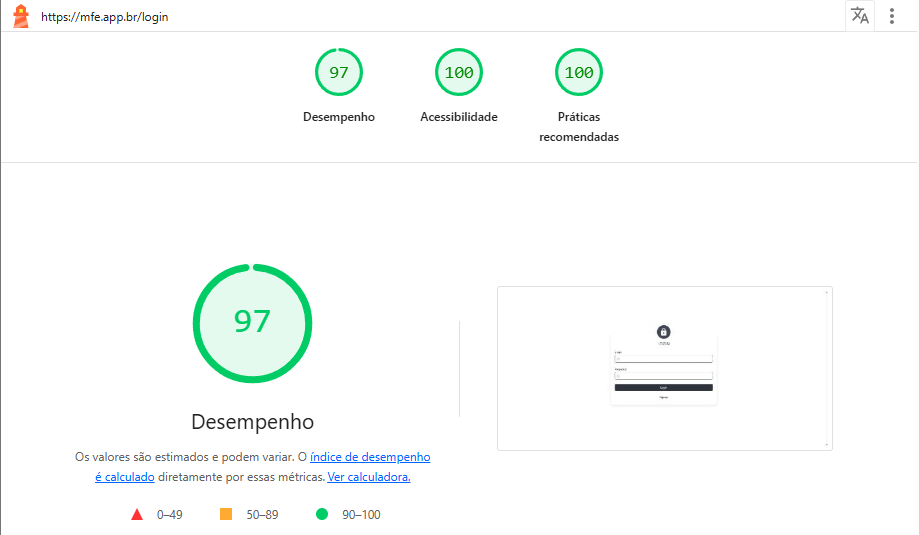
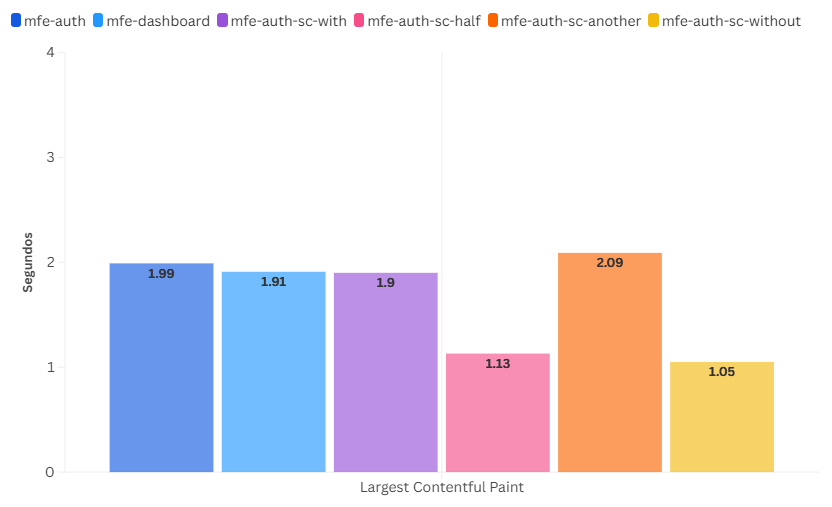
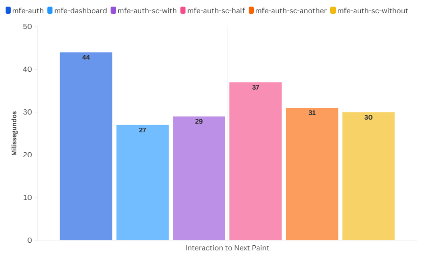
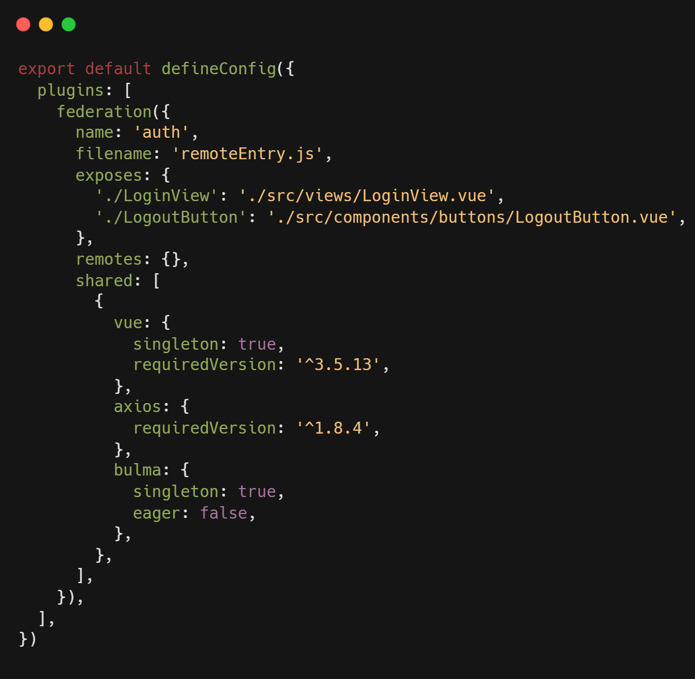
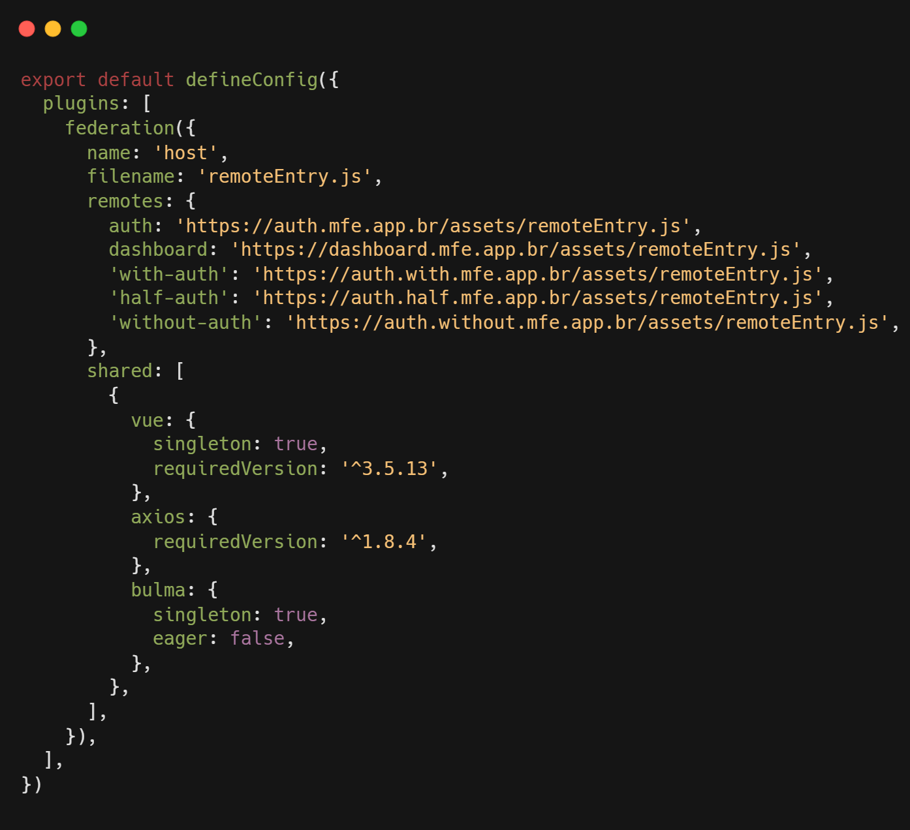
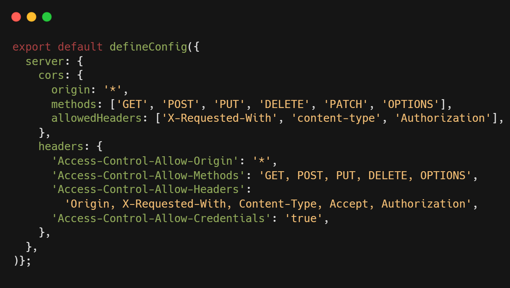

# 5 RESULTADOS

Conforme estabelecido, aspectos de desempenho, complexidade de implementação e segurança foram analisados. A seguir, são
descritas as observações para cada critério.

**5.1 Desempenho**

Para analisar o desempenho da aplicação, foi necessário realizar a publicação do sistema (MFESHOWCASE, 2025), de forma a
obter dados mais representativos do ambiente de produção. Em ambiente de desenvolvimento local, as métricas poderiam ser
distorcidas por fatores como a ausência de minificação de código, uso de bibliotecas de apoio e configurações de
depuração, impactando negativamente a avaliação.

A ferramenta Lighthouse foi utilizada para gerar um relatório (MFECODIGO, 2025) de performance geral (Figura 6). No
ambiente de produção, a aplicação hospedada no domínio mfe.app.br apresentou uma pontuação geral de 97 pontos em
desempenho, 100 em acessibilidade e 100 em melhores práticas. Esses resultados evidenciam que a aplicação está otimizada
para carregamento eficiente e acessibilidade, além de seguir boas práticas de desenvolvimento.

Figura 6 – Relatório gerado pelo Lighthouse da aplicação (MFESHOWCASE, 2025).

Fonte: Chrome DevTools Lighthouse (2025).

A análise comparativa — elaborada a partir dos relatórios (MFECODIGO, 2025) gerados pela aba performance da ferramenta
Chrome DevTools — entre os diferentes Microfrontends desenvolvidos (Gráfico 1) revela que, de modo geral, os tempos de
FCP permanecem próximos de 1 a 2 segundos e os tempos do LCP ficam entre 27 e 44 milissegundos. Indicando um bom tempo
de resposta para a maioria dos módulos, esses valores estão alinhados com as melhores práticas recomendadas para
aplicações web (Quadro 2), evidenciando que o uso do Module Federation e o carregamento assíncrono foram implementados
de forma eficaz, garantindo uma experiência de usuário fluida.

Além disso, os relatórios mostraram que o CLS permaneceu em zero para todos os módulos, demonstrando a estabilidade do
layout e a ausência de deslocamentos inesperados que poderiam comprometer a experiência do usuário (Quadro 2). Esse
resultado reforça a maturidade da arquitetura e a atenção dada aos detalhes de usabilidade.

Gráfico 1 – Gráfico da métrica LCP de cada MFE remoto carregado dentro do mfe-host.

Fonte: elaborado pelos autores (2025).

Gráfico 2 – Gráfico da métrica INP de cada MFE remoto carregado dentro do mfe-host.

Fonte: elaborado pelos autores (2025).

De forma geral, a análise evidencia que a arquitetura de Microfrontends, aliada ao uso de carregamento assíncrono e
otimizações de desempenho, resultou em uma aplicação rápida, estável e alinhada às boas práticas de desenvolvimento web
moderno.

**5.2 Complexidade de Implementação**

Durante o desenvolvimento e configuração do ambiente, foram enfrentados diversos desafios, entre eles: (i) a definição e
configuração dos módulos remotos para expor seus ativos corretamente; (ii) a configuração do módulo hospedeiro para
consumir os ativos dos remotos via URLs externas; (iii) a execução de todos os MFE em modo HTTPS (HyperText Transfer
Protocol Secure) (HTTPS, 2025) localmente, requisito para o funcionamento adequado com cookies HTTP e segurança entre
domínios; (iv) as estratégias de compartilhamento de dados entre os MFE, incluindo informações de usuário; (v) a
garantia do compartilhamento de dependências comuns evitando conflitos de versão; (vi) a criação de novos MFE a partir
de uma estrutura comum — o que evidencia a importância de manter um template base com arquitetura e configurações
padronizadas; e (vii) a execução local de todos os MFE, uma vez que o Module Federation opera sobre arquivos já
construídos, exigindo que cada MFE remoto seja construído e iniciado em modo preview para funcionar corretamente no
ambiente de desenvolvimento.

A respeito da configuração do Module Federation, observa-se que, de modo geral, ela não apresenta grandes desafios, pois
segue uma estrutura relativamente intuitiva e objetiva. Nessa configuração, é possível declarar quais recursos serão
expostos (exposes), quais serão consumidos de outros módulos (remotes) e quais dependências deverão ser compartilhadas (
shared) entre os módulos participantes (Figura 7 e Figura 8).

Figura 7 – Trecho do código de configuração do Module Federation no mfe-auth.

Fonte: elaborado pelos autores (2025).

Figura 8 – Trecho do código de configuração do Module Federation no mfe-host.

Fonte: elaborado pelos autores (2025).

Adicionalmente, para viabilizar a integração entre os MFE remotos e a aplicação hospedeira, foi necessário realizar
ajustes específicos na configuração do Vite em cada módulo remoto (Figura 9). Essa etapa foi fundamental para assegurar
que o hospedeiro pudesse consumir os recursos disponibilizados pelos remotos sem restrições de acesso ou problemas de
comunicação. Embora a configuração siga uma estrutura relativamente simples, ela exigiu conhecimento técnico aprofundado
sobre o Vite, especialmente no que se refere à gestão de CORS (Cross-Origin Resource Sharing) (CORS, 2025), resultando
em uma curva de aprendizado média.

Figura 9 – Trecho do código de configuração do Vite para viabilizar o consumo dos MFE.

Fonte: elaborado pelos autores (2025).

Outro ponto importante relacionado à complexidade de implementação foi a etapa de publicação dos módulos no Cloudflare
Pages (MFESHOWCASE, 2025). Foi necessário configurar o domínio principal (mfe.app.br) e atribuir subdomínios para cada
MFE, garantindo o isolamento e a integração correta entre eles. Para o mfe-auth-sc-another, não foi configurado um
subdomínio, pois era essencial para o caso de uso que ele estivesse em outro domínio. A configuração de DNS (Domain Name
System) (DNS, 2025) para apontar cada subdomínio para o respectivo projeto exigiu atenção especial para evitar conflitos
e garantir o funcionamento adequado das rotas. Para o processo de publicação, utilizou-se a estratégia de empacotamento
com Vite, gerando o diretório de código publicável (dist) para cada MFE e, em seguida, atribuindo cada dist ao
respectivo projeto no Cloudflare Pages, o que facilitou a publicação contínua e a atualização independente dos módulos.

Apesar da complexidade inicial, uma vez estabelecida a estrutura base, a adição e integração de novos MFE tornaram-se
tarefas mais simples. A modularidade da arquitetura proporcionou maior independência entre os projetos, ainda que o
custo de iniciar todos os MFE localmente represente um desafio prático.

**5.3 Segurança**

A utilização de cookies HTTP como estratégia para SSO mostrou-se mais segura que o uso de tokens em localStorage ou
sessionStorage. Isso porque evita a exposição direta das credenciais no navegador.

Algumas boas práticas adotadas durante a implementação contribuíram para reforçar a segurança da aplicação, entre
elas: (i) utilização de HTTPS com cookies configurados com SameSite=None e Secure=true (HTTPCOOKIES, 2025), garantindo
integridade e confidencialidade nas sessões; (ii) implementação de validação de origem e controle de CORS nas chamadas
HTTP; (iii) separação clara entre o MFE responsável pela autenticação (mfe-auth) e os MFE consumidores, evitando
vazamentos de contexto sensível; (iv) ausência de exposição de tokens JSON Web Token (JWT) no lado do cliente.

Apesar das medidas adotadas, para fins de comprovação da existência do cookie na aplicação showcase, a configuração
httpOnly (HTTPCOOKIES, 2025) dos cookies foi desabilitada — uma prática que não é recomendada em ambientes reais, pois
compromete a proteção contra acessos indevidos via scripts maliciosos no navegador.

**5.4 Análise dos Resultados e Discussão**

Com a aplicação showcase desenvolvida, foi possível constatar que o login único, proporcionado pelo SSO, representa uma
alternativa eficaz para sistemas front-end distribuídos. A utilização de cookies HTTP seguros, configurados para um ou
mais domínios, simplificou a autenticação entre os diferentes Microfrontends e garantiu maior segurança nas requisições
feitas para a API. Essa abordagem evita a exposição de tokens no lado do cliente (navegador), reduzindo a superfície de
ataque e contribuindo para uma arquitetura mais segura e coesa.

Também foi observado que a adoção do Module Federation no ecossistema Vite mostrou-se uma alternativa viável para a
construção de Microfrontends. A composição entre os MFE remotos e o MFE hospedeiro funcionou de forma satisfatória,
permitindo a exposição e o consumo dinâmico dos módulos de maneira eficiente. No entanto, assim como apontado por
Bahiense-Junior et al. (2024) ao analisar o uso da Module Federation no Webpack, a implementação dessa arquitetura no
Vite também exige conhecimentos aprofundados da ferramenta, além da definição cuidadosa de estratégias para o
compartilhamento de dados. Complementando a recomendação dos autores sobre o uso de eventos customizados e do padrão
publish/subscribe, foi possível constatar, com base na aplicação desenvolvida, que o uso de um estado global
compartilhado também se mostrou eficaz para apoiar a comunicação em tempo real entre os MFE.

Além disso, as análises de desempenho realizadas evidenciaram que a aplicação showcase apresentou tempos de carregamento
satisfatórios e uma experiência de uso fluida, confirmando que a composição dinâmica via Module Federation não gerou
impactos negativos para o usuário final.

Outro ponto importante é a complexidade de gerenciar múltiplos projetos em execução simultânea no ambiente local. Em
contextos reais, é fundamental definir domínios, recursos compartilhados e estratégias de comunicação para garantir o
desacoplamento entre os Microfrontends. Uma estratégia para reduzir a dependência entre projetos é a utilização de
objetos simulados (mocks) durante o desenvolvimento, permitindo implementar funcionalidades de forma isolada.

Apesar das vantagens, a arquitetura de Microfrontends não é uma solução universal para todos os problemas de
escalabilidade. Ela requer planejamento cuidadoso, definição clara das responsabilidades de cada módulo e atenção às
interdependências. A modularização excessiva pode aumentar a complexidade, dificultar o gerenciamento de dependências e
tornar o processo de desenvolvimento mais oneroso.

Portanto, a adoção de Microfrontends deve ser feita de forma deliberada e alinhada aos objetivos do projeto, avaliando
se seus benefícios superam os desafios de implementação. Essa abordagem é mais indicada para aplicações de larga escala,
com múltiplas equipes trabalhando em paralelo ou em casos em que há necessidade de independência entre módulos e
atualização contínua. Já para projetos menores ou com equipes reduzidas, a complexidade adicional pode não se justificar
frente aos benefícios esperados. 